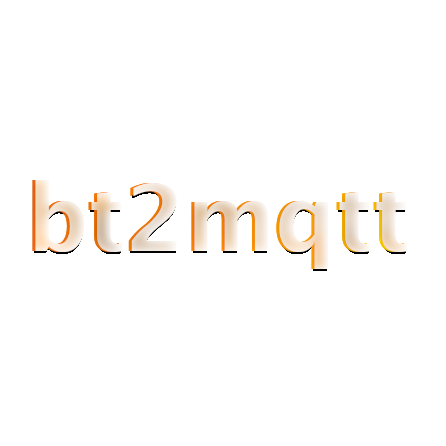

# bt2mqtt

Multiarch alpine-based image that bridges Bluetooth presence events to an MQTT topic at a fixed interval.

<div align="center">



[](https://github.com/Sykkro/bt2mqtt/actions?query=workflow%3Abuildx)
[](https://hub.docker.com/repository/docker/sykkro/bt2mqtt)
[](https://hub.docker.com/repository/docker/sykkro/bt2mqtt)
[](https://hub.docker.com/repository/docker/sykkro/bt2mqtt)

</div>

---

## Building

> **NOTE:** Requires Docker's BuildX to build multiarch image

```bash
docker buildx build \
--platform=linux/amd64,linux/arm/v6,linux/arm/v7,linux/arm64 \
--output "type=image,push=false" \
-t sykkro/bt2mqtt:latest .
```

## Running

### Locally

```bash
# (assumes a conf/devices.conf file)
./bt2mqtt.sh
```

### In Docker

```bash
docker run --rm -it --net=host -v <path to local conf directory>:/conf --name bt2mqtt bt2mqtt:latest
```